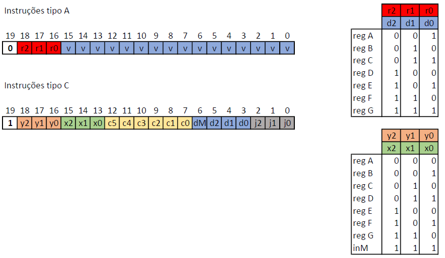

# Av3 - 2° Semestre de 2023


Avaliação 3 - Elementos de Sistemas

| Pontos HW | Pontos SW |
|:---------:|:---------:|
| 20        | 35        |

- Avaliação **individual**.
- **120 min** total.
- Ficar no blackboard durante a prova.
- Clonar o seu repositório (e trabalhar nele)
- Fazer **commit** ao final de cada questão.
- Lembre de dar **push** ao final.


As questões de hardware (`.vhd`) devem ser implementadas nos arquivos localizados na pasta `src/vhd`, as questões de software (`nasm`) devem ser implementadas nos arquivos localizados em `src/nasm`. 

Não há testes para a parte de HW.

Para testar SW, execute:

```
./compileALL.py
SIM=ghdl pytest --tb=no -s
```


**LEMBRE DE REALIZAR UM COMMIT (A CADA QUESTÃO) E DAR PUSH AO FINALIZAR**

## 1. Assembly - parte 1

**Inserir um valor em um vetor**

| Pontos HW | Pontos SW |
|:---------:|:---------:|
| 0         | 10        |

Faça um programa em Assembly que substitua um valor na RAM por outro.

A **posição** do valor a ser substituído será indicada na RAM[2].

O novo valor a ser salvo está indicada na RAM[1].

    
#### Exemplo 1:

Representação na memória:
```
RAM[0]  ="0000000000000001"
RAM[1]  ="0000000000000010"
RAM[2]  ="0000000000001010"
RAM[10] = "0000111100001111"
```
Resultado:
```
RAM[10] = "0000000000000010"
```

### Implementação

Implemente o código Assembly no arquivo `src/nasm/change.nasm`

**Lembre de descomentar o módulo no arquivo config_testes_nasm.txt e testar com `SIM=ghdl pytest --tb=no -s`**

#### Rubrica para avaliação:

| Pontos SW | Descritivo                                                                   |
|-----------|------------------------------------------------------------------------------|
| 10        | Demonstrar conhecimento dos comandos básicos do Assembly utilizado           |


## 2. Assembly - parte 2

**Inserir um valor em um vetor**

| Pontos HW | Pontos SW |
|:---------:|:---------:|
| 0         | 10        |

Faça um código em Assembly que substitua um valor na RAM apenas se o mesmo for igual à outro salvo na memória.

O valor que pode ser substituído se encontra na RAM[10].

O novo valor se encontra na RAM[1] e o valor usado no teste de igualdade se encontra na RAM[0].
  
    
#### Exemplo 1:

Representação na memória:
```
RAM[0]  ="0000111100001111"
RAM[1]  ="0000000000000010"
RAM[10] = "0000111100001111"
```
Resultado:
```
RAM[10] = "0000000000000010"
```

#### Exemplo 2:

Representação na memória:
```
RAM[0]  ="0000000010000001"
RAM[1]  ="0000000000000010"
RAM[10] = "0000000000000001"
```
Resultado:
```
RAM[10] = "0000000000000001"
```

### Implementação

Implemente o código Assembly no arquivo `src/nasm/change_if.nasm`

**Lembre de descomentar o módulo no arquivo config_testes_nasm.txt e testar com `SIM=ghdl pytest --tb=no -s`**

#### Rubrica para avaliação:

| Pontos SW | Descritivo                                                                   |
|-----------|------------------------------------------------------------------------------|
| 10        | Demonstrar conhecimento da realização de condicionais em Assembly            |


## 3. Assembly - parte 3

**Inserir um valor em um vetor**

| Pontos HW | Pontos SW |
|:---------:|:---------:|
| 0         | 15        |

Considere um vetor de 10 valores armazenados na RAM a partir da posição RAM[20].

Escreva um programa em Assembly que substitua um valor no vetor. O valor a ser substituído está indicado na RAM[0]. O novo valor está indicado na RAM[1].

Os LEDs devem mostrar o número de substituições realizadas em binário.

    
#### Exemplo 1:

Representação na memória:
```
RAM[0]  ="0000000000000001"
RAM[1]  ="0000000000000010"
RAM[20] = "0000111100001111"
RAM[21] = "0011001100110011"
RAM[22] = "0011001100110011"
RAM[23] = "0000111100001111"
RAM[24] = "0000111100001111"
RAM[25] = "0000000000000001"
RAM[26] = "0000111100001111"
RAM[27] = "0000111100001111"
RAM[28] = "0000111100001111"
RAM[29] = "0000111100001111"
```
Resultado:
```
RAM[20] = "0000111100001111"
RAM[21] = "0011001100110011"
RAM[22] = "0011001100110011"
RAM[23] = "0000111100001111"
RAM[24] = "0000111100001111"
RAM[25] = "0000000000000010"
RAM[26] = "0000111100001111"
RAM[27] = "0000111100001111"
RAM[28] = "0000111100001111"
RAM[29] = "0000111100001111"
LEDs    = "0000000000000001"
```

#### Exemplo 2:

Representação na memória:
```
RAM[0]  ="0000000010000001"
RAM[1]  ="0000000000000010"
RAM[20] = "0000000000000001"
RAM[21] = "0011001100110011"
RAM[22] = "0011001100110011"
RAM[23] = "0000111100001111"
RAM[24] = "0000111100001111"
RAM[25] = "0000000000000001"
RAM[26] = "0000111100001111"
RAM[27] = "0000111100001111"
RAM[28] = "0000111100001111"
RAM[29] = "0000000000000001"
```
Resultado:
```
RAM[20] = "0000000000000001"
RAM[21] = "0011001100110011"
RAM[22] = "0011001100110011"
RAM[23] = "0000111100001111"
RAM[24] = "0000111100001111"
RAM[25] = "0000000000000001"
RAM[26] = "0000111100001111"
RAM[27] = "0000111100001111"
RAM[28] = "0000111100001111"
RAM[29] = "0000000000000001"
LEDs    = "0000000000000000"
```
### Implementação

Implemente o código Assembly no arquivo `src/nasm/change_loop.nasm`

**Lembre de descomentar o módulo no arquivo config_testes_nasm.txt e testar com `SIM=ghdl pytest --tb=no -s`**

#### Rubrica para avaliação:

| Pontos SW | Descritivo                                                                   |
|-----------|------------------------------------------------------------------------------|
| 10        | Demonstrar conhecimento de realização loops em Assembly                      |
| 5         | Demonstrar conhecimento da utilização de periféricos                         |


## 4. CPU modificada

**JMP**

| Pontos HW | Pontos SW |
|:---------:|:---------:|
| 20        |   0       |

Queremos alterar a estrutura da CPU para ter mais flexibilidade nas operações com a ULA. Para isso, foram incluidos registradores e os mux, como indicado na figura.
 


Dessa forma, o formato das instruções passará a ter 20 bits, conforme apresentado a seguir:



onde os bits r2 r1 r0 na instrução tipo A indica qual dos registradores irá carregar um valor a partir da instrução.
Para as instruções do tipo C, os vetores bits (x2 x1 x0) e (y2 y1 y0) selecionam os registradores ou a entrada da memória que serão usados na entradas X e Y da ULA. Já os bits d2 d1 d0 indicam em qual registrador o resultado da ULA será salvo. O valor d2d1d0 = "000" não salva o resultado da ULA em nenhum registrador. Já o bit dM indica o salvamento na memória RAM. Nesta versão da CPU, pode-se salvar em 1 registrador e na memória em um mesmo ciclo de clock.

No entanto, queremos ainda fazer uma mudança adicional de forma a permitir que o valor de qualquer um dos registradores entre %A e %G possa ser carregado no PC em caso de salto.

### Questões


- Implemente no arquivo `vhd/CPU2.vhd` a mudança adicional de forma a permitir que o valor de qualquer um dos registradores entre %A e %G possa ser carregado no PC em caso de salto (_essa modificação não é mostrada na figura do CPU_).
- Para que a implementação acima seja efetivada, é necessário alterar formato das instruções. Neste caso, o salto deve apontar qual registrador indica o destino. No arquivo `vhd/controlUnit2.vhd`, proponha (_como comentário_) um novo formato de instrução que implemente a modificação.


#### Rubrica para avaliação:

| Pontos HW | Descritivo                                |
|-----------|-------------------------------------------|
| 10        | Implementação no arquivo CPU2.vhd         |
| 10        | Proposição no arquivo controlUnit2.vhd    |
